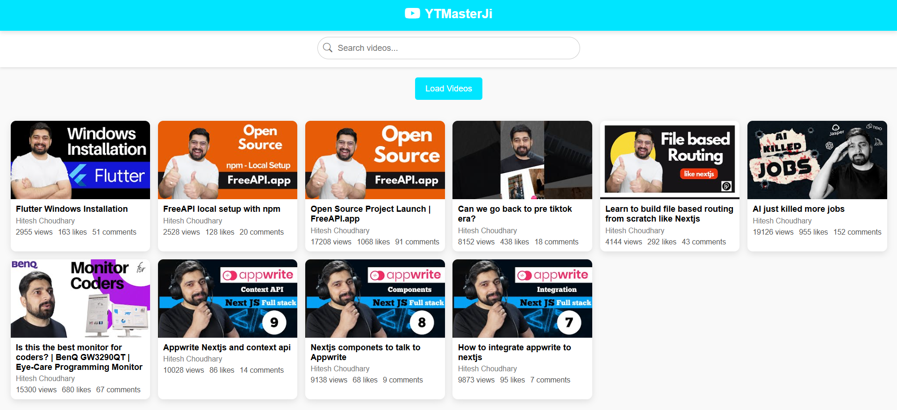

# **YTMasterJi**  

YTMasterJi is a web-based platform designed for seamless YouTube video browsing. It utilizes a FreeAPI YouTube endpoint to fetch and display videos directly on the website. Users can explore available videos and click on any selection to be redirected to YouTube for playback.  

## **Features**  

- **Fetch and Display Videos** – Retrieves a curated list of YouTube videos dynamically.  
- **Video Details** – Displays video thumbnails, titles, and channel names for better context.  
- **One-Click Redirection** – Users can click on a video to watch it directly on YouTube.  
- **Search Functionality** – A frontend search bar allows users to filter videos efficiently without external API calls.  
- **User-Friendly Interface** – Grid-based layout ensures an intuitive and visually appealing browsing experience.  


## **API endpoint**  

- API link: [**API**](https://api.freeapi.app/api/v1/public/youtube/videos)
- API Docs: [**FreeAPI Guide**](https://freeapi.hashnode.space/api-guide/apireference/getYoutubeVideos)


## **Deployment Link**  

Access YTMasterJi here: [**Live Demo**](#)  

## **Screenshots**  



## **Technologies Used**

- HTML
- CSS
- JavaScript
- FreeAPI Youtube endpoint

## **Installation & Setup**  

To run YTMasterJi locally, follow these steps:  

1. **Clone the Repository:**  
   ```sh
   git clone https://github.com/your-username/YTMasterJi.git
   cd YTMasterJi
2. **Navigate to the folder:**
    ```sh
    cd YTMasterJi
3. Open: the below file in the browser
    ```sh
    index.html